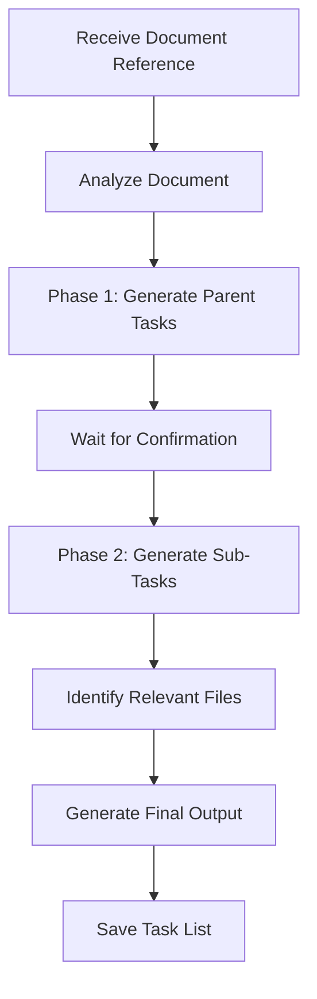

# Task: Generating a Task List from a PRD or CRD

## Goal

To guide claude code in creating a detailed, step-by-step task list in Markdown format based on an existing Product Requirements Document (PRD) or Change Request Document (CRD). The task list should guide subagents through implementation of new features or changes to existing functionality.

Tasks should be high‑level summaries that capture the core functionality of a feature or change. Each task must be actionable, concise, and unambiguous, making it clear what needs to be done without diving into low‑level implementation details.

## Output

- **Format:** Markdown (`.md`)
- **Location:** 
  - For PRD: `/docs/features/[feature-name]/tasks.md`
  - For CRD: `/docs/changes/[change-name]/tasks.md`

## Process

1. Receive Document Reference: The user points Claude Code to a specific PRD or CRD file.
2. Analyze Document: Claude Code reads and analyzes the requirements document (requirements, user stories, goals, success criteria, and other relevant details).
3. Phase 1 – Generate Parent Tasks: From the analysis, generate a tasks.md draft containing high‑level parent tasks that represent the main functionality of the feature or change.
  - Tasks must be concise, actionable, and easy to understand.
  - Use judgment to determine the appropriate number of parent tasks.
  - Present these tasks to the user for review (without sub‑tasks yet).
4. Wait for Confirmation: Pause and wait for user feedback. Iterate on the parent tasks until the user approves.
5. Phase 2 – Generate Sub‑Tasks: After approval, expand each parent task into smaller, actionable sub‑tasks that logically follow from the PRD/CRD. These sub‑tasks cover implementation details needed to fulfill each parent task.
6. Identify Relevant Files: Review the codebase and determine which files must be created or modified, including related test files. List these under a Relevant Files section.
7. Generate Final Output: Combine the confirmed parent tasks, sub‑tasks, relevant files, and notes into the final Markdown structure.
8. Save Task List: Save the completed tasks.md in the appropriate directory
  - For a PRD: `/docs/features/[feature-name]/tasks.md`
  - For a CRD: `/docs/changes/[change-name]/tasks.md`



## Output Format

The generated task list _must_ follow this structure:

```markdown
## Relevant Files

- `path/to/potential/file1.ts` - Brief description of why this file is relevant (e.g., Contains the main component for this feature OR Existing component that needs modification).
- `path/to/file1.test.ts` - Unit tests for `file1.ts`.
- `path/to/another/file.tsx` - Brief description (e.g., API route handler for data submission OR Existing API that requires changes).
- `path/to/another/file.test.tsx` - Unit tests for `another/file.tsx`.
- `lib/utils/helpers.ts` - Brief description (e.g., Utility functions needed for calculations OR Existing utilities to be refactored).
- `lib/utils/helpers.test.ts` - Unit tests for `helpers.ts`.
...

### Notes

- Include any additional notes or context that is relevant to the task list. Keep it concise and highly relevant.
- Assume the primary reader of the task list is a **capable junior developer** who will implement the feature or change. For CRDs, provide extra context about the current implementation to help developers understand what they're modifying and why.

## Tasks

- [ ] 1.0 Parent Task Title
  - [ ] 1.1 [Sub-task description 1.1]
  - [ ] 1.2 [Sub-task description 1.2]
- [ ] 2.0 Parent Task Title
  - [ ] 2.1 [Sub-task description 2.1]
- [ ] 3.0 Parent Task Title (may not require sub-tasks if purely structural or configuration)
```